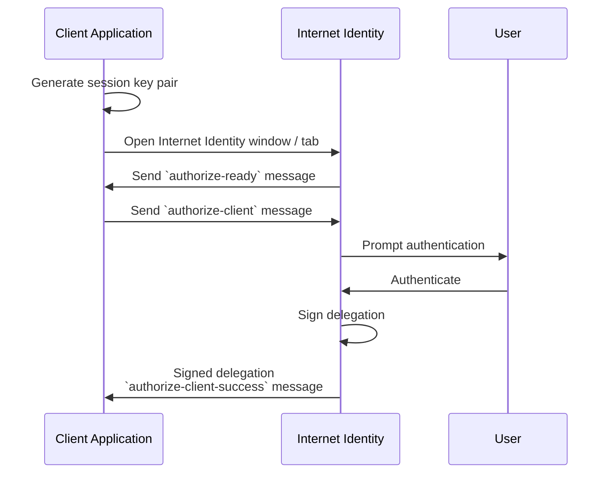

## Introduction

This document describes and specifies Internet Identity from various angles and at various levels of abstraction, namely:

-   High level goals, requirements and use cases.

-   Overview of the security and identity machinery, including the interplay of identities, keys, and delegations.

-   Interface as used by client applications frontends, i.e., our [client authentication protocol](#client-authentication-protocol).

-   The interface of the Internet Identity Service *backend*, i.e., describing its contract at the Candid layer, as used by its frontend.

-   Important implementation notes about the Internet Identity Service backend.

The Internet Identity service consists of:

-   Its backend, a canister on ICP. More precisely, a canister on a dedicated subnet with a *well-known* canister id, and

-   its frontend, a web application served by the backend canister.

Similarly, the client applications consist of a frontend (served by a canister) and (typically) one or more backend canisters. Only the frontend interacts with the Internet Identity Service directly (via the [client authentication protocol](#client-authentication-protocol) described below).

## Goals, requirements and use cases

The Internet Identity service allows users to

-   maintain identities on the Internet Computer

-   log in with these identities using one out of a set of security devices

-   manage their set of security devices

Some functional requirements are

-   users have separate identities (or "pseudonyms") per client application (more precisely, per client application frontend "hostname", though see [Alternative Frontend Origins](#alternative-frontend-origins) for caveat about `.raw` domains)

-   these identities are stable, i.e., do not depend on a user's security devices

-   the client frontends interact with any canister on the Internet Computer under the user's identity with that frontend

-   users do not need ever to remember secret information (but possibly per-user non-secret information)

-   a security device does not need to be manually touched upon every interaction with a client application; a login is valid for a certain amount of time per identity

Some security requirements are

-   The separate identities of a single user cannot be related merely based on their public key or principal ids, to impede user tracking.

-   The security of the identities does not depend on the privacy of data stored on canisters, or transmitted to and from canisters. In particular, the delegations handed out by the backend canister must not be sensitive information.

-   (many more, of course; apply common sense)

Some noteworthy security assumptions are:

-   The delivery of frontend applications is secure. In particular, a user accessing the Internet Identity Service Frontend through a TLS-secured HTTP connection cannot be tricked into running another web application.

:::note
Just for background: At launch this meant we relied on the trustworthiness of the boundary nodes as well as the replica the boundary nodes happens to fetch the assets from. After launch, certification of our HTTP Gateway protocol and trustworthy client-side code (browser extensions, proxies, etc.) have improved this situation.
:::

-   The security devices only allow the use of their keys from the same web application that created the key (in our case, the Internet Identity Service Frontend).

-   The user's browser is trustworthy, `postMessage` communication between different origins is authentic.

-   For user privacy, we also assume the Internet Identity Service backend can keep a secret (but since data is replicated, we do not rely on this assumption for other security properties).

## Identity design and data model


The Internet Computer serves this frontend under hostnames `https://identity.internetcomputer.org` (official) and `https://identity.ic0.app` (legacy).

The canister maintains a salt (in the following the `salt`), a 32 byte long blob that is obtained via the Internet Computer's source of secure randomness.


:::note
Due to replication of data in canisters, the salt should not be considered secret against a determined attacker. However, the canister will not reveal the salt directly and to the extent it is unknown to an attacker it helps maintain privacy of user identities.
:::

A user account is identified by a unique *Identity Anchor*, a natural number chosen by the canister.

A client application frontend is identified by its origin (e.g., `https://abcde-efg.ic0.app`, `https://nice-name.com`). Frontend applications can be served by canisters or by websites that are not hosted on the Internet Computer.

A user has a separate *user identity* for each client application frontend (i.e., per origin). This identity is a [*self-authenticating id*](./ic-interface-spec.md#id-classes) of the [DER encoded canister signature public key](./ic-interface-spec.md/#canister-signatures) which has the form
```
user_id = SHA-224(DER encoded public key) · 0x02` (29 bytes)
```

and the `BIT STRING` field of the DER encoded public key has the form
```
bit_string = |ii_canister_id| · ii_canister_id · seed
```

where the `seed` is derived as follows
```
seed = H(|salt| · salt · |user_number| · user_number · |frontend_origin| · frontend_origin)
```

where `H` is SHA-256, `·` is concatenation, `|…|` is a single byte representing the length of `…` in bytes, `user_number` is the ASCII-encoding of the Identity Anchor as a decimal number, and `frontend_origin` is the ASCII-encoding of the client application frontend's origin (at most 255 bytes).

:::note
A `frontend_origin` of the form `https://<canister id>.icp0.io` will be rewritten to `https://<canister id>.ic0.app` before being used in the seed. This ensures transparent pseudonym transfer between apps hosted on `ic0.app` and `icp0.io` domains.
:::

When a client application frontend wants to authenticate as a user, it uses a *session key* (e.g., Ed25519 or ECDSA), and by way of the authentication flow (details below) obtains a [*delegation chain*](./ic-interface-spec.md#authentication) that allows the session key to sign for the user's main identity.

The delegation chain consists of one delegation, called the *client delegation*. It delegates from the user identity (for the given client application frontend) to the session key. This delegation is created by the Internet Identity Service Canister, and signed using a [canister signature](./ic-interface-spec.md/#canister-signatures). This delegation is unscoped (valid for all canisters) and has a maximum lifetime of 30 days, with a default of 30 minutes.

The Internet Identity service frontend also manages an *identity frontend delegation*, delegating from the security device's public key to a session key managed by this frontend, so that it can interact with the backend without having to invoke the security device for each signature.

## Client authentication protocol

This section describes the Internet Identity service from the point of view of a client application frontend.



1.  The client application frontend creates a session key pair (e.g., Ed25519).

2.  It installs a `message` event handler on its own `window`.

3.  It loads the url `https://identity.internetcomputer.org/#authorize` in a separate tab. Let `identityWindow` be the `Window` object returned from this.

4.  In the `identityWindow`, the user logs in, and the `identityWindow` invokes
    ```ts
    window.opener.postMessage(msg, "*")
    ```

    where `msg` is
    ```ts
    interface InternetIdentityReady {
      kind: "authorize-ready"
    }
    ```

5.  The client application, after receiving the `InternetIdentityReady`, invokes
    ```ts
    identityWindow.postMessage(msg, "https://identity.internetcomputer.org")
    ```

    where `msg` is a value of type
    ```ts
    interface InternetIdentityAuthRequest {
      kind: "authorize-client";
      sessionPublicKey: Uint8Array;
      maxTimeToLive?: bigint;
      allowPinAuthentication?: boolean;
      derivationOrigin?: string;
      autoSelectionPrincipal?: string
    }
    ```

    where

    -   the `sessionPublicKey` contains the public key of the session key pair.

    -   the `maxTimeToLive`, if present, indicates the desired time span (in nanoseconds) until the requested delegation should expire. The Identity Provider frontend is free to set an earlier expiry time, but should not create a one larger.

    -   the `allowPinAuthentication` (EXPERIMENTAL), if present, indicates whether or not the Identity Provider should allow the user to authenticate and/or register using a temporary key/PIN identity. Authenticating dapps may want to prevent users from using Temporary keys/PIN identities because Temporary keys/PIN identities are less secure than Passkeys (webauthn credentials) and because Temporary keys/PIN identities generally only live in a browser database (which may get cleared by the browser/OS).

    -   the `derivationOrigin`, if present, indicates an origin that should be used for principal derivation instead of the client origin. Internet Identity will validate the `derivationOrigin` by checking that it lists the client application origin in the `/.well-known/ii-alternative-origins` file (see [Alternative Frontend Origins](#alternative-frontend-origins)).

    -   the `autoSelectionPrincipal`, if present, indicates the textual representation of this dapp's principal for which the delegation is requested. If it is known to Internet Identity and the corresponding identity has been the most recently used for the client application origin, it will skip the identity selection and immediately prompt for authentication. This feature can be used to streamline re-authentication after a session expiry.


6.  Now the client application window expects a message back, with data `event`.

7.  If `event.origin` is not either `"https://identity.ic0.app"` or `"https://identity.internetcomputer.org"` (depending on which endpoint you are using), ignore this message.

8.  The `event.data` value is a JS object with the following type:
    ```ts
    interface InternetIdentityAuthResponse {
      kind: "authorize-client-success";
      delegations: [{
        delegation: {
          pubkey: Uint8Array;
          expiration: bigint;
          targets?: Principal[];
        };
        signature: Uint8Array;
      }];
      userPublicKey: Uint8Array;
      authnMethod: "passkey";
    }
    ```

    where the `userPublicKey` is the user's Identity on the given frontend and `delegations` corresponds to the CBOR-encoded delegation chain as used for [*authentication on the IC*](./ic-interface-spec.md#authentication) and `authnMethod` is the method used by the user to authenticate (`passkey` for webauthn, `pin` for temporary key/PIN identity, and `recovery` for recovery phrase or recovery device).

9.  It could also receive a failure message of the following type
    ```ts
    interface InternetIdentityAuthResponse {
      kind: "authorize-client-failure";
      text: string;
    }
    ```

    The client application frontend needs to be able to detect when any of the delegations in the chain has expired, and re-authorize the user in that case.

The [`@dfinity/auth-client`](https://www.npmjs.com/package/@dfinity/auth-client) NPM package provides helpful functionality here.

The client application frontend should support delegation chains of length more than one, and delegations with `targets`, even if the present version of this spec does not use them, to be compatible with possible future versions.

:::note
The Internet Identity frontend will use `event.origin` as the "Frontend URL" to base the user identity on. This includes protocol, full hostname and port. This means

-   Changing protocol, hostname (including subdomains) or port will invalidate all user identities.
    - However, multiple different frontend URLs can be mapped back to the canonical frontend URL, see [Alternative Frontend Origins](#alternative-frontend-origins).
    - Frontend URLs on `icp0.io` are mapped to `ic0.app` automatically, see [Identity design and data model](#identity-design-and-data-model).
-   The frontend application must never allow any untrusted JavaScript code to be executed, on any page on that origin. Be careful when implementing a JavaScript playground on the Internet Computer.
:::

## Alternative frontend origins

To allow flexibility regarding the canister frontend URL, the client may choose to provide another URL as the `derivationOrigin` (see [Client authentication protocol](#client-authentication-protocol)). This means that Internet Identity will issue the same principals to the frontend (which uses a different origin) as it would if it were using the `derivationOrigin` directly.
This feature works for `canisterId` based URLs and [ICP custom domains](../guides/frontends/custom-domains.md) (backed by canisters) as `derivationOrigin`.

:::caution
This feature is intended to allow more flexibility with respect to the origins of a _single_ service. Do _not_ use this feature to allow _third party_ services to use the same principals. Only add origins you fully control to `/.well-known/ii-alternative-origins` and never set origins you do not control as `derivationOrigin`!
:::

:::note
`https://<canister_id>.ic0.app` and `https://<canister_id>.raw.ic0.app` do _not_ issue the same principals by default . However, this feature can also be used to map `https://<canister_id>.raw.ic0.app` to `https://<canister_id>.ic0.app` principals or vice versa.
:::

In order for Internet Identity to accept the `derivationOrigin` the origin of the client application must be listed in the JSON object served on the URL `https://<canister_id>.icp0.io/.well-known/ii-alternative-origins` (i.e. the file must be hosted by an ICP canister that must implement the `http_request` query call as specified [here](./http-gateway-spec.md)).


### JSON Schema {#alternative-frontend-origins-schema}


``` json
{
  "$schema": "https://json-schema.org/draft/2020-12/schema",
  "title": "II Alternative Origins Principal Derivation Origins",
  "description": "An object containing the alternative frontend origins of the given canister, which are allowed to use the URL this document is hosted on for principal derivation.",
  "type": "object",
  "properties": {
    "alternativeOrigins": {
      "description": "List of allowed alternative frontend origins",
      "type": "array",
      "items": {
        "type": "string"
      },
      "minItems": 0,
      "maxItems": 10,
      "uniqueItems": true
    }
  },
  "required": [ "alternativeOrigins" ]
}
```


### Example
``` json
{
  "alternativeOrigins": [
    "https://alternative-1.com",
    "https://www.nice-frontend-name.org"
  ]
}
```

:::note
The path `/.well-known/ii-alternative-origins` will always be requested using the non-raw `https://<canister_id>.ic0.app` domain (even if the `derivationOrigin` uses a `.raw`) and _must_ be delivered as a certified asset. Requests to `/.well-known/ii-alternative-origins` _must_ be answered with a `200` HTTP status code. More specifically Internet Identity _will not_ follow redirects and fail with an error instead. These measures are required in order to prevent malicious boundary nodes or replicas from tampering with `ii-alternative-origins`.
:::

:::note
To prevent misuse of this feature, the number of alternative origins _must not_ be greater than 10.
:::

:::note
In order to allow Internet Identity to read the path `/.well-known/ii-alternative-origins`, the CORS response header [`Access-Control-Allow-Origin`](https://developer.mozilla.org/en-US/docs/Web/HTTP/Headers/Access-Control-Allow-Origin) must be set and allow the Internet Identity origin `https://identity.internetcomputer.org`.
:::

## The Internet Identity Service Backend interface

This section describes the interface that the backend canister provides.

Note that the interface is split into 4 categories:
* Identity management API, i.e. APIs for end-users to manage their identity.
  * Legacy API.
  * API v2 (experimental, incomplete).
    * The aim of the API v2 is to introduce changes that cannot be made without breaking existing clients of the legacy API. While the API v2 has feature parity with the legacy API, the desired changes are not fully implemented yet:
      * Methods should return proper results with meaningful errors.
      * Adding explicit WebAuthn signatures to security critical operations.
* HTTP gateway protocol, required to serve `https://identity.internetcomputer.org`.
* Auth protocol, for creating signed delegations.
* Verifiable credentials protocol, for creating id alias credentials.
* Internal methods, not intended to be called by external clients.
    * These are methods related to initialization of II itself and integration with its archive.

The summary is given by the Candid interface:

```candid
type UserNumber = nat64;
type AccountNumber = nat64;
type PublicKey = blob;
type CredentialId = blob;
type DeviceKey = PublicKey;
type UserKey = PublicKey;
type SessionKey = PublicKey;
type FrontendHostname = text;
type Timestamp = nat64;

type HeaderField = record {
    text;
    text;
};

type HttpRequest = record {
    method : text;
    url : text;
    headers : vec HeaderField;
    body : blob;
    certificate_version : opt nat16;
};

type HttpResponse = record {
    status_code : nat16;
    headers : vec HeaderField;
    body : blob;
    upgrade : opt bool;
    streaming_strategy : opt StreamingStrategy;
};

type StreamingCallbackHttpResponse = record {
    body : blob;
    token : opt Token;
};

type Token = record {};

type StreamingStrategy = variant {
    Callback : record {
        callback : func(Token) -> (StreamingCallbackHttpResponse) query;
        token : Token;
    };
};

type Purpose = variant {
    recovery;
    authentication;
};

type KeyType = variant {
    unknown;
    platform;
    cross_platform;
    seed_phrase;
    browser_storage_key;
};

// This describes whether a device is "protected" or not.
// When protected, a device can only be updated or removed if the
// user is authenticated with that very device.
type DeviceProtection = variant {
    protected;
    unprotected;
};

type Challenge = record {
    png_base64 : text;
    challenge_key : ChallengeKey;
};

type DeviceData = record {
    pubkey : DeviceKey;
    alias : text;
    credential_id : opt CredentialId;
    purpose : Purpose;
    key_type : KeyType;
    protection : DeviceProtection;
    origin : opt text;
    // Metadata map for additional device information.
    //
    // Note: some fields above will be moved to the metadata map in the future.
    // All field names of `DeviceData` (such as 'alias', 'origin, etc.) are
    // reserved and cannot be written.
    // In addition, the keys "usage" and "authenticator_attachment" are reserved as well.
    metadata : opt MetadataMap;
};

// The same as `DeviceData` but with the `last_usage` field.
// This field cannot be written, hence the separate type.
type DeviceWithUsage = record {
    pubkey : DeviceKey;
    alias : text;
    credential_id : opt CredentialId;
    purpose : Purpose;
    key_type : KeyType;
    protection : DeviceProtection;
    origin : opt text;
    last_usage : opt Timestamp;
    metadata : opt MetadataMap;
};

type DeviceKeyWithAnchor = record {
    pubkey : DeviceKey;
    anchor_number : UserNumber;
};

// Map with some variants for the value type.
// Note, due to the Candid mapping this must be a tuple type thus we cannot name the fields `key` and `value`.
type MetadataMap = vec record {
    text;
    variant { map : MetadataMap; string : text; bytes : vec nat8 };
};

type RegisterResponse = variant {
    // A new user was successfully registered.
    registered : record {
        user_number : UserNumber;
    };
    // No more registrations are possible in this instance of the II service canister.
    canister_full;
    // The challenge was not successful.
    bad_challenge;
};

type AddTentativeDeviceResponse = variant {
    // The device was tentatively added.
    added_tentatively : record {
        verification_code : text;
        // Expiration date, in nanos since the epoch
        device_registration_timeout : Timestamp;
    };
    // Device registration mode is off, either due to timeout or because it was never enabled.
    device_registration_mode_off;
    // There is another device already added tentatively
    another_device_tentatively_added;
};

type VerifyTentativeDeviceResponse = variant {
    // The device was successfully verified.
    verified;
    // Wrong verification code entered. Retry with correct code.
    wrong_code : record {
        retries_left : nat8;
    };
    // Device registration mode is off, either due to timeout or because it was never enabled.
    device_registration_mode_off;
    // There is no tentative device to be verified.
    no_device_to_verify;
};

type Delegation = record {
    pubkey : PublicKey;
    expiration : Timestamp;
    targets : opt vec principal;
};

type SignedDelegation = record {
    delegation : Delegation;
    signature : blob;
};

type GetDelegationResponse = variant {
    // The signed delegation was successfully retrieved.
    signed_delegation : SignedDelegation;

    // The signature is not ready. Maybe retry by calling `prepare_delegation`
    no_such_delegation;
};

type InternetIdentityStats = record {
    users_registered : nat64;
    storage_layout_version : nat8;
    assigned_user_number_range : record {
        nat64;
        nat64;
    };
    archive_info : ArchiveInfo;
    canister_creation_cycles_cost : nat64;
    // Map from event aggregation to a sorted list of top 100 sub-keys to their weights.
    // Example: {"prepare_delegation_count 24h ic0.app": [{"https://dapp.com", 100}, {"https://dapp2.com", 50}]}
    event_aggregations : vec record { text; vec record { text; nat64 } };
};

// Configuration parameters related to the archive.
type ArchiveConfig = record {
    // The allowed module hash of the archive canister.
    // Changing this parameter does _not_ deploy the archive, but enable archive deployments with the
    // corresponding wasm module.
    module_hash : blob;
    // Buffered archive entries limit. If reached, II will stop accepting new anchor operations
    // until the buffered operations are acknowledged by the archive.
    entries_buffer_limit : nat64;
    // The maximum number of entries to be transferred to the archive per call.
    entries_fetch_limit : nat16;
    // Polling interval to fetch new entries from II (in nanoseconds).
    // Changes to this parameter will only take effect after an archive deployment.
    polling_interval_ns : nat64;
};

// Information about the archive.
type ArchiveInfo = record {
    // Canister id of the archive or empty if no archive has been deployed yet.
    archive_canister : opt principal;
    // Configuration parameters related to the II archive.
    archive_config : opt ArchiveConfig;
};

// Rate limit configuration.
// Currently only used for `register`.
type RateLimitConfig = record {
    // Time it takes (in ns) for a rate limiting token to be replenished.
    time_per_token_ns : nat64;
    // How many tokens are at most generated (to accommodate peaks).
    max_tokens : nat64;
};

// Captcha configuration
// Default:
// - max_unsolved_captchas: 500
// - captcha_trigger: Static, CaptchaEnabled
type CaptchaConfig = record {
    // Maximum number of unsolved captchas.
    max_unsolved_captchas : nat64;
    // Configuration for when captcha protection should kick in.
    captcha_trigger : variant {
        // Based on the rate of registrations compared to some reference time frame and allowing some leeway.
        Dynamic : record {
            // Percentage of increased registration rate observed in the current rate sampling interval (compared to
            // reference rate) at which II will enable captcha for new registrations.
            threshold_pct : nat16;
            // Length of the interval in seconds used to sample the current rate of registrations.
            current_rate_sampling_interval_s : nat64;
            // Length of the interval in seconds used to sample the reference rate of registrations.
            reference_rate_sampling_interval_s : nat64;
        };
        // Statically enable / disable captcha
        Static : variant {
            CaptchaEnabled;
            CaptchaDisabled;
        };
    };
};

// Init arguments of II which can be supplied on install and upgrade.
//
// Each field is wrapped is `opt` to indicate whether the field should
// keep the previous value or update to a new value (e.g. `null` keeps the previous value).
//
// Some fields, like `openid_google`, have an additional nested `opt`, this indicates
// enable/disable status (e.g. `opt null` disables a feature while `null` leaves it untouched).
type InternetIdentityInit = record {
    // Set lowest and highest anchor
    assigned_user_number_range : opt record {
        nat64;
        nat64;
    };
    // Configuration parameters related to the II archive.
    // Note: some parameters changes (like the polling interval) will only take effect after an archive deployment.
    // See ArchiveConfig for details.
    archive_config : opt ArchiveConfig;
    // Set the amounts of cycles sent with the create canister message.
    // This is configurable because in the staging environment cycles are required.
    // The canister creation cost on mainnet is currently 100'000'000'000 cycles. If this value is higher thant the
    // canister creation cost, the newly created canister will keep extra cycles.
    canister_creation_cycles_cost : opt nat64;
    // Rate limit for the `register` call.
    register_rate_limit : opt RateLimitConfig;
    // Configuration of the captcha in the registration flow.
    captcha_config : opt CaptchaConfig;
    // Configuration for Related Origins Requests.
    // If present, list of origins from where registration is allowed.
    related_origins : opt vec text;
    // Configuration for New Origin Flows.
    // If present, list of origins using the new authentication flow.
    new_flow_origins : opt vec text;
    // Configuration for OpenID Google client
    openid_google : opt opt OpenIdConfig;
    // Configuration for Web Analytics
    analytics_config : opt opt AnalyticsConfig;
    // Configuration to fetch root key or not from frontend assets
    fetch_root_key : opt bool;
    // Configuration to show dapps explorer or not
    enable_dapps_explorer : opt bool;
    // Configuration to set the canister as production mode.
    // For now, this is used only to show or hide the banner.
    is_production : opt bool;
};

type ChallengeKey = text;

type ChallengeResult = record {
    key : ChallengeKey;
    chars : text;
};
type CaptchaResult = ChallengeResult;

// Extra information about registration status for new devices
type DeviceRegistrationInfo = record {
    // If present, the user has tentatively added a new device. This
    // new device needs to be verified (see relevant endpoint) before
    // 'expiration'.
    tentative_device : opt DeviceData;
    // The timestamp at which the anchor will turn off registration mode
    // (and the tentative device will be forgotten, if any, and if not verified)
    expiration : Timestamp;
};

// Information about the anchor
type IdentityAnchorInfo = record {
    // All devices that can authenticate to this anchor
    devices : vec DeviceWithUsage;
    // Device registration status used when adding devices, see DeviceRegistrationInfo
    device_registration : opt DeviceRegistrationInfo;
    // OpenID accounts linked to this anchor
    openid_credentials : opt vec OpenIdCredential;
    // The name of the Internet Identity
    name : opt text;
};

type AnchorCredentials = record {
    credentials : vec WebAuthnCredential;
    recovery_credentials : vec WebAuthnCredential;
    recovery_phrases : vec PublicKey;
};

type WebAuthnCredential = record {
    credential_id : CredentialId;
    pubkey : PublicKey;
};

type DeployArchiveResult = variant {
    // The archive was deployed successfully and the supplied wasm module has been installed. The principal of the archive
    // canister is returned.
    success : principal;
    // Initial archive creation is already in progress.
    creation_in_progress;
    // Archive deployment failed. An error description is returned.
    failed : text;
};

type BufferedArchiveEntry = record {
    anchor_number : UserNumber;
    timestamp : Timestamp;
    sequence_number : nat64;
    entry : blob;
};

// OpenID specific types

type Iss = text;
type Sub = text;
type Aud = text;
type JWT = text;
type Salt = blob;

type OpenIdConfig = record {
    client_id : text;
};

type OpenIdCredentialKey = record { Iss; Sub };

type AnalyticsConfig = variant {
    Plausible : record {
        domain : opt text;
        hash_mode : opt bool;
        track_localhost : opt bool;
        api_host : opt text;
    };
};

type OpenIdCredential = record {
    iss : Iss;
    sub : Sub;
    aud : Aud;
    last_usage_timestamp : opt Timestamp;
    metadata : MetadataMapV2;
};

type OpenIdCredentialAddError = variant {
    Unauthorized : principal;
    JwtVerificationFailed;
    OpenIdCredentialAlreadyRegistered;
    InternalCanisterError : text;
};

type OpenIdCredentialRemoveError = variant {
    Unauthorized : principal;
    OpenIdCredentialNotFound;
    InternalCanisterError : text;
};

type OpenIdDelegationError = variant {
    NoSuchAnchor;
    JwtVerificationFailed;
    NoSuchDelegation;
};

type OpenIdPrepareDelegationResponse = record {
    user_key : UserKey;
    expiration : Timestamp;
    anchor_number : UserNumber;
};

// API V2 specific types
// WARNING: These type are experimental and may change in the future.

type IdentityNumber = nat64;

// Map with some variants for the value type.
// Note, due to the Candid mapping this must be a tuple type thus we cannot name the fields `key` and `value`.
type MetadataMapV2 = vec record {
    text;
    variant { Map : MetadataMapV2; String : text; Bytes : vec nat8 };
};

// Authentication method using WebAuthn signatures
// See https://www.w3.org/TR/webauthn-2/
// This is a separate type because WebAuthn requires to also store
// the credential id (in addition to the public key).
type WebAuthn = record {
    credential_id : CredentialId;
    pubkey : PublicKey;
};

// Authentication method using generic signatures
// See ./ic-interface-spec.md/#signatures for
// supported signature schemes.
type PublicKeyAuthn = record {
    pubkey : PublicKey;
};

// The authentication methods currently supported by II.
type AuthnMethod = variant {
    WebAuthn : WebAuthn;
    PubKey : PublicKeyAuthn;
};

// This describes whether an authentication method is "protected" or not.
// When protected, a authentication method can only be updated or removed if the
// user is authenticated with that very authentication method.
type AuthnMethodProtection = variant {
    Protected;
    Unprotected;
};

type AuthnMethodPurpose = variant {
    Recovery;
    Authentication;
};

type AuthnMethodSecuritySettings = record {
    protection : AuthnMethodProtection;
    purpose : AuthnMethodPurpose;
};

type AuthnMethodData = record {
    authn_method : AuthnMethod;
    security_settings : AuthnMethodSecuritySettings;
    // contains the following fields of the DeviceWithUsage type:
    // - alias
    // - origin
    // - authenticator_attachment: data taken from key_type and reduced to "platform", "cross_platform" or absent on migration
    // - usage: data taken from key_type and reduced to "recovery_phrase", "browser_storage_key" or absent on migration
    // Note: for compatibility reasons with the v1 API, the entries above (if present)
    // must be of the `String` variant. This restriction may be lifted in the future.
    metadata : MetadataMapV2;
    last_authentication : opt Timestamp;
};

type OpenIDRegFinishArg = record {
    jwt : JWT;
    salt : Salt;
};

// Extra information about registration status for new authentication methods
type AuthnMethodRegistrationInfo = record {
    // If present, the user has registered a new authentication method. This
    // new authentication needs to be verified before 'expiration' in order to
    // be added to the identity.
    authn_method : opt AuthnMethodData;
    // The timestamp at which the identity will turn off registration mode
    // (and the authentication method will be forgotten, if any, and if not verified)
    expiration : Timestamp;
};

type AuthnMethodConfirmationCode = record {
    confirmation_code : text;
    expiration : Timestamp;
};

type AuthnMethodRegisterError = variant {
    // Authentication method registration mode is off, either due to timeout or because it was never enabled.
    RegistrationModeOff;
    // There is another authentication method already registered that needs to be confirmed first.
    RegistrationAlreadyInProgress;
    // The metadata of the provided authentication method contains invalid entries.
    InvalidMetadata : text;
};

type AuthnMethodConfirmationError = variant {
    // Wrong confirmation code entered. Retry with correct code.
    WrongCode : record {
        retries_left : nat8;
    };
    // Authentication method registration mode is off, either due to timeout or because it was never enabled.
    RegistrationModeOff;
    // There is no registered authentication method to be confirmed.
    NoAuthnMethodToConfirm;
};

type IdentityAuthnInfo = record {
    authn_methods : vec AuthnMethod;
    recovery_authn_methods : vec AuthnMethod;
};

type IdentityInfo = record {
    authn_methods : vec AuthnMethodData;
    authn_method_registration : opt AuthnMethodRegistrationInfo;
    openid_credentials : opt vec OpenIdCredential;
    // Authentication method independent metadata
    metadata : MetadataMapV2;
};

type IdentityInfoError = variant {
    // The principal is not authorized to call this method with the given arguments.
    Unauthorized : principal;
    // Internal canister error. See the error message for details.
    InternalCanisterError : text;
};

type AuthnMethodAddError = variant {
    InvalidMetadata : text;
};

type AuthnMethodReplaceError = variant {
    InvalidMetadata : text;
    // No authentication method found with the given public key.
    AuthnMethodNotFound;
};

type AuthnMethodMetadataReplaceError = variant {
    InvalidMetadata : text;
    // No authentication method found with the given public key.
    AuthnMethodNotFound;
};

type AuthnMethodSecuritySettingsReplaceError = variant {
    // No authentication method found with the given public key.
    AuthnMethodNotFound;
};

type IdentityMetadataReplaceError = variant {
    // The principal is not authorized to call this method with the given arguments.
    Unauthorized : principal;
    // The identity including the new metadata exceeds the maximum allowed size.
    StorageSpaceExceeded : record {
        space_available : nat64;
        space_required : nat64;
    };
    // Internal canister error. See the error message for details.
    InternalCanisterError : text;
};

type CreateAccountError = variant {
    InternalCanisterError : text;
    AccountLimitReached;
    Unauthorized : principal;
};

type UpdateAccountError = variant {
    InternalCanisterError : text;
    AccountLimitReached;
    Unauthorized : principal;
};

type AccountDelegationError = variant {
    InternalCanisterError : text;
    Unauthorized : principal;
    NoSuchDelegation;
};

type PrepareAccountDelegation = record {
    user_key : UserKey;
    expiration : Timestamp;
};

type GetAccountsError = variant {
    InternalCanisterError : text;
    Unauthorized : principal;
};

type PrepareIdAliasRequest = record {
    // Origin of the issuer in the attribute sharing flow.
    issuer : FrontendHostname;
    // Origin of the relying party in the attribute sharing flow.
    relying_party : FrontendHostname;
    // Identity for which the IdAlias should be generated.
    identity_number : IdentityNumber;
};

type PrepareIdAliasError = variant {
    // The principal is not authorized to call this method with the given arguments.
    Unauthorized : principal;
    // Internal canister error. See the error message for details.
    InternalCanisterError : text;
};

// The prepared id alias contains two (still unsigned) credentials in JWT format,
// certifying the id alias for the issuer resp. the relying party.
type PreparedIdAlias = record {
    rp_id_alias_jwt : text;
    issuer_id_alias_jwt : text;
    canister_sig_pk_der : PublicKey;
};

// The request to retrieve the actual signed id alias credentials.
// The field values should be equal to the values of corresponding
// fields from the preceding `PrepareIdAliasRequest` and `PrepareIdAliasResponse`.
type GetIdAliasRequest = record {
    rp_id_alias_jwt : text;
    issuer : FrontendHostname;
    issuer_id_alias_jwt : text;
    relying_party : FrontendHostname;
    identity_number : IdentityNumber;
};

type GetIdAliasError = variant {
    // The principal is not authorized to call this method with the given arguments.
    Unauthorized : principal;
    // The credential(s) are not available: may be expired or not prepared yet (call prepare_id_alias to prepare).
    NoSuchCredentials : text;
    // Internal canister error. See the error message for details.
    InternalCanisterError : text;
};

// The signed id alias credentials for each involved party.
type IdAliasCredentials = record {
    rp_id_alias_credential : SignedIdAlias;
    issuer_id_alias_credential : SignedIdAlias;
};

type SignedIdAlias = record {
    credential_jws : text;
    id_alias : principal;
    id_dapp : principal;
};

type IdRegNextStepResult = record {
    // The next step in the registration flow
    next_step : RegistrationFlowNextStep;
};

type IdRegStartError = variant {
    // The method was called anonymously, which is not supported.
    InvalidCaller;
    // Too many registrations. Please try again later.
    RateLimitExceeded;
    // A registration flow is already in progress.
    AlreadyInProgress;
};

// The next step in the registration flow:
// - CheckCaptcha: supply the solution to the captcha using `check_captcha`
// - Finish: finish the registration using `identity_registration_finish`
type RegistrationFlowNextStep = variant {
    // Supply the captcha solution using check_captcha
    CheckCaptcha : record {
        captcha_png_base64 : text;
    };
    // Finish the registration using identity_registration_finish
    Finish;
};

type CheckCaptchaArg = record {
    solution : text;
};

type CheckCaptchaError = variant {
    // The supplied solution was wrong. Try again with the new captcha.
    WrongSolution : record {
        new_captcha_png_base64 : text;
    };
    // This call is unexpected, see next_step.
    UnexpectedCall : record {
        next_step : RegistrationFlowNextStep;
    };
    // No registration flow ongoing for the caller.
    NoRegistrationFlow;
};

type IdRegFinishArg = record {
    authn_method : AuthnMethodData;
    name : opt text;
};

type IdRegFinishResult = record {
    identity_number : nat64;
};

type IdRegFinishError = variant {
    // The configured maximum number of identities has been reached.
    IdentityLimitReached;
    // This call is unexpected, see next_step.
    UnexpectedCall : record {
        next_step : RegistrationFlowNextStep;
    };
    // No registration flow ongoing for the caller.
    NoRegistrationFlow;
    // The supplied authn_method is not valid.
    InvalidAuthnMethod : text;
    // Error while persisting the new identity.
    StorageError : text;
};

type AccountInfo = record {
    // Null is unreserved default account
    account_number : opt AccountNumber;
    origin : text;
    last_used : opt Timestamp;
    // Configurable properties
    name : opt text;
};

type AccountUpdate = record {
    name : opt text;
};


service : (opt InternetIdentityInit) -> {
    // Legacy identity management API
    // ==============================

    create_challenge : () -> (Challenge);
    register : (DeviceData, ChallengeResult, opt principal) -> (RegisterResponse);
    add : (UserNumber, DeviceData) -> ();
    update : (UserNumber, DeviceKey, DeviceData) -> ();
    // Atomically replace device matching the device key with the new device data
    replace : (UserNumber, DeviceKey, DeviceData) -> ();
    remove : (UserNumber, DeviceKey) -> ();
    // Returns all devices of the user (authentication and recovery) but no information about device registrations.
    // Note: Clears out the 'alias' fields on the devices. Use 'get_anchor_info' to obtain the full information.
    // Deprecated: Use 'get_anchor_credentials' instead.
    lookup : (UserNumber) -> (vec DeviceData) query;
    get_anchor_credentials : (UserNumber) -> (AnchorCredentials) query;
    get_anchor_info : (UserNumber) -> (IdentityAnchorInfo);
    get_principal : (UserNumber, FrontendHostname) -> (principal) query;

    enter_device_registration_mode : (UserNumber) -> (Timestamp);
    exit_device_registration_mode : (UserNumber) -> ();
    add_tentative_device : (UserNumber, DeviceData) -> (AddTentativeDeviceResponse);
    verify_tentative_device : (UserNumber, verification_code : text) -> (VerifyTentativeDeviceResponse);

    // V2 Identity Management API
    // ==========================
    // WARNING: The following methods are experimental and may ch 0ange in the future.

    // Starts the identity registration flow to create a new identity.
    identity_registration_start : () -> (variant { Ok : IdRegNextStepResult; Err : IdRegStartError });

    // Check the captcha challenge
    // If successful, the registration can be finished with `identity_registration_finish`.
    check_captcha : (CheckCaptchaArg) -> (variant { Ok : IdRegNextStepResult; Err : CheckCaptchaError });

    // Starts the identity registration flow to create a new identity.
    identity_registration_finish : (IdRegFinishArg) -> (variant { Ok : IdRegFinishResult; Err : IdRegFinishError });

    // Returns information about the authentication methods of the identity with the given number.
    // Only returns the minimal information required for authentication without exposing any metadata such as aliases.
    identity_authn_info : (IdentityNumber) -> (variant { Ok : IdentityAuthnInfo; Err }) query;

    // Returns information about the identity with the given number.
    // Requires authentication.
    identity_info : (IdentityNumber) -> (variant { Ok : IdentityInfo; Err : IdentityInfoError });

    // Replaces the authentication method independent metadata map.
    // The existing metadata map will be overwritten.
    // Requires authentication.
    identity_metadata_replace : (IdentityNumber, MetadataMapV2) -> (variant { Ok; Err : IdentityMetadataReplaceError });

    // Adds a new authentication method to the identity.
    // Requires authentication.
    authn_method_add : (IdentityNumber, AuthnMethodData) -> (variant { Ok; Err : AuthnMethodAddError });

    // Atomically replaces the authentication method matching the supplied public key with the new authentication method
    // provided.
    // Requires authentication.
    authn_method_replace : (IdentityNumber, PublicKey, AuthnMethodData) -> (variant { Ok; Err : AuthnMethodReplaceError });

    // Replaces the authentication method metadata map.
    // The existing metadata map will be overwritten.
    // Requires authentication.
    authn_method_metadata_replace : (IdentityNumber, PublicKey, MetadataMapV2) -> (variant { Ok; Err : AuthnMethodMetadataReplaceError });

    // Replaces the authentication method security settings.
    // The existing security settings will be overwritten.
    // Requires authentication.
    authn_method_security_settings_replace : (IdentityNumber, PublicKey, AuthnMethodSecuritySettings) -> (variant { Ok; Err : AuthnMethodSecuritySettingsReplaceError });

    // Removes the authentication method associated with the public key from the identity.
    // Requires authentication.
    authn_method_remove : (IdentityNumber, PublicKey) -> (variant { Ok; Err });

    // Enters the authentication method registration mode for the identity.
    // In this mode, a new authentication method can be registered, which then needs to be
    // confirmed before it can be used for authentication on this identity.
    // The registration mode is automatically exited after the returned expiration timestamp.
    // Requires authentication.
    authn_method_registration_mode_enter : (IdentityNumber) -> (variant { Ok : record { expiration : Timestamp }; Err });

    // Exits the authentication method registration mode for the identity.
    // Requires authentication.
    authn_method_registration_mode_exit : (IdentityNumber) -> (variant { Ok; Err });

    // Registers a new authentication method to the identity.
    // This authentication method needs to be confirmed before it can be used for authentication on this identity.
    authn_method_register : (IdentityNumber, AuthnMethodData) -> (variant { Ok : AuthnMethodConfirmationCode; Err : AuthnMethodRegisterError });

    // Confirms a previously registered authentication method.
    // On successful confirmation, the authentication method is permanently added to the identity and can
    // subsequently be used for authentication for that identity.
    // Requires authentication.
    authn_method_confirm : (IdentityNumber, confirmation_code : text) -> (variant { Ok; Err : AuthnMethodConfirmationError });

    // Authentication protocol
    // =======================
    prepare_delegation : (UserNumber, FrontendHostname, SessionKey, maxTimeToLive : opt nat64) -> (UserKey, Timestamp);
    get_delegation : (UserNumber, FrontendHostname, SessionKey, Timestamp) -> (GetDelegationResponse) query;

    // Attribute Sharing MVP API
    // =========================
    // The methods below are used to generate ID-alias credentials during attribute sharing flow.
    prepare_id_alias : (PrepareIdAliasRequest) -> (variant { Ok : PreparedIdAlias; Err : PrepareIdAliasError });
    get_id_alias : (GetIdAliasRequest) -> (variant { Ok : IdAliasCredentials; Err : GetIdAliasError }) query;

    // OpenID credentials protocol
    // =========================
    openid_identity_registration_finish : (OpenIDRegFinishArg) -> (variant { Ok : IdRegFinishResult; Err : IdRegFinishError });
    openid_credential_add : (IdentityNumber, JWT, Salt) -> (variant { Ok; Err : OpenIdCredentialAddError });
    openid_credential_remove : (IdentityNumber, OpenIdCredentialKey) -> (variant { Ok; Err : OpenIdCredentialRemoveError });
    openid_prepare_delegation : (JWT, Salt, SessionKey) -> (variant { Ok : OpenIdPrepareDelegationResponse; Err : OpenIdDelegationError });
    openid_get_delegation : (JWT, Salt, SessionKey, Timestamp) -> (variant { Ok : SignedDelegation; Err : OpenIdDelegationError }) query;

    // HTTP Gateway protocol
    // =====================
    http_request : (request : HttpRequest) -> (HttpResponse) query;
    http_request_update : (request : HttpRequest) -> (HttpResponse);

    // Internal Methods
    // ================
    init_salt : () -> ();
    stats : () -> (InternetIdentityStats) query;
    config : () -> (InternetIdentityInit) query;

    deploy_archive : (wasm : blob) -> (DeployArchiveResult);
    // Returns a batch of entries _sorted by sequence number_ to be archived.
    // This is an update call because the archive information _must_ be certified.
    // Only callable by this IIs archive canister.
    fetch_entries : () -> (vec BufferedArchiveEntry);
    acknowledge_entries : (sequence_number : nat64) -> ();

    // Discoverable passkeys protocol
    lookup_device_key : (credential_id : blob) -> (opt DeviceKeyWithAnchor) query;

    // Multiple accounts
    get_accounts : (
        anchor_number : UserNumber,
        origin : FrontendHostname,
    ) -> (variant { Ok : vec AccountInfo; Err: GetAccountsError }) query;

    create_account : (
        anchor_number : UserNumber,
        origin : FrontendHostname,
        name : text
    ) -> (variant { Ok : AccountInfo; Err: CreateAccountError });

    update_account : (
        anchor_number : UserNumber,
        origin : FrontendHostname,
        account_number : opt AccountNumber, // Null is unreserved default account
        update : AccountUpdate
    ) ->  (variant { Ok : AccountInfo; Err: UpdateAccountError });

    prepare_account_delegation : (
        anchor_number : UserNumber,
        origin : FrontendHostname,
        account_number : opt AccountNumber, // Null is unreserved default account
        session_key : SessionKey,
        max_ttl : opt nat64
    ) -> (variant { Ok : PrepareAccountDelegation; Err : AccountDelegationError });
    
    get_account_delegation : (
        anchor_number : UserNumber,
        origin : FrontendHostname,
        account_number : opt AccountNumber, // Null is unreserved default account
        session_key : SessionKey,
        expiration : Timestamp
    ) -> (variant { Ok : SignedDelegation; Err : AccountDelegationError }) query;
};
```

### Identity management (legacy API)
#### The `create_challenge` and `register`  methods

**Authorization**: This `register` request must be sent to the canister with `caller` that is the self-authenticating id derived from the given `DeviceKey`.

The `register` method is used to create a new user. The Internet Identity Service backend creates a *fresh* Identity Anchor, creates the account record, and adds the given device as the first device.

In order to protect the Internet Computer from too many "free" update calls, and to protect the Internet Identity Service from too many user registrations, this call is protected using a CAPTCHA challenge. The `register` call can only succeed if the `ChallengeResult` contains a `key` for a challenge that was created with `create_challenge` (see below) in the last 5 minutes *and* if the `chars` match the characters that the Internet Identity Service has stored internally for that `key`.

#### The `add` method

:::note
API V2: `authn_method_add`
:::

**Authorization**: This request must be sent to the canister with `caller` that is the self-authenticating id derived from any of the public keys of devices associated with the user before this call.

The `add` method appends a new device to the given user's record.

The Internet Identity Service backend rejects the call if the user already has a device on record with the given public key.

This may also fail (with a *reject*) if the user is registering too many devices.

#### The `remove` method

:::note
API V2: `authn_method_remove`
:::

**Authorization**: This request must be sent to the canister with `caller` that is the self-authenticating id derived from any of the public keys of devices associated with the user before this call.

The `remove` method removes a device, identified by its public key, from the list of devices a user has.

It is allowed to remove the key that is used to sign this request. This can be useful for a panic button functionality.

It is allowed to remove the last key, to completely disable a user. The canister may forget that user completely then, assuming the Identity Anchor generation algorithm prevents new users from getting the same Identity Anchor.

It is the responsibility of the frontend UI to protect the user from doing these things accidentally.

:::note
If the device has the `protected` flag, then the request must be sent to the canister with `caller` that is the self-authenticating id derived from the public key of that particular device.
:::

#### The `replace` method

:::note
API V2: `authn_method_replace`
:::

**Authorization**: This request must be sent to the canister with `caller` that is the self-authenticating id derived from any of the public keys of devices associated with the user before this call.

The `replace` method atomically replaces a device, identified by its public key from the list of devices a user has with another one supplied as an argument.

It is allowed to replace the key that is used to sign this request. The replace method is useful to replace the recovery phrase with another one, making sure that at all times there is exactly one recovery phrase associated with the identity.

It is the responsibility of the frontend UI to protect the user from doing these things accidentally.

:::note
If the device has the `protected` flag, then the request must be sent to the canister with `caller` that is the self-authenticating id derived from the public key of that particular device.
:::

#### The `enter_device_registration_mode` method

:::note
API V2: `authn_method_registration_mode_enter`
:::

**Authorization**: This request must be sent to the canister with `caller` that is the self-authenticating id derived from any of the public keys of devices associated with the user before this call.

Enables device registration mode for the given identity anchor. When device registration mode is active, new devices can be added using `add_tentative_device` and `verify_tentative_device`. Device registration mode stays active for at most 15 minutes or until the flow is either completed or aborted.

#### The `exit_device_registration_mode` method

:::note
API V2: `authn_method_registration_mode_exit`
:::

**Authorization**: This request must be sent to the canister with `caller` that is the self-authenticating id derived from any of the public keys of devices associated with the user before this call.

Exits device registration mode immediately. Any non verified tentative devices are discarded.

#### The `add_tentative_device` method

:::note
API V2: `authn_method_register`
:::

**Authorization**: Anyone can call this

Tentatively adds a new device to the supplied identity anchor and returns a verification code. This code has to be used with the `verify_tentative_device` method to verify this device. If the flow is aborted or not completed within 15 minutes, the tentative device is discarded.

Tentatively added devices cannot be used to login into the management view or authorize authentications for other dApps.

#### The `verify_tentative_device` method

:::note
API V2: `authn_method_confirm`
:::

**Authorization**: This request must be sent to the canister with `caller` that is the self-authenticating id derived from any of the public keys of devices associated with the user before this call.

For an anchor in device registration mode: if called with a valid verification code, adds the tentative device as a regular device to the anchor and exits registration mode. The registration flow is aborted if this method is called five times with invalid verification codes.

Returns an error if called for a device not in registration mode.

#### The `lookup` query method

:::note
API V2: `identity_authn_info`
:::

**Authorization**: Anyone can call this

Fetches all device data associated with a user. Since this method can be called by anyone, the information returned is limited. In particular, any fields containing potentially personal information are stripped away (such as the metadata or alias fields).

#### The `get_anchor_info` method

:::note
API V2: `identity_info`
:::

**Authorization**: This request must be sent to the canister with `caller` that is the self-authenticating id derived from any of the public keys of devices associated with the user before this call.

Fetches all data associated with an anchor including registration mode and tentatively registered devices.

#### The `get_principal` query method
**Authorization**: This request must be sent to the canister with `caller` that is the self-authenticating id derived from any of the public keys of devices associated with the user before this call.

Fetches the principal for a given user and front end.

### Identity management (API V2 only)

#### The `identity_registration_start` method

**Authorization**: Any non-anonymous identity can call this

Initiates the registration of a new identity. Identity registration is a multistep process:
1. Start the registration (this call). 
2. Solve the captcha, if any. Whether this step is required is indicated by the result of the first (this) call.
3. Provide an authentication method to authenticate with in the future.

The `sender` principal must be the same in all subsequent calls. After successfully completing the registration flow, this principal is authorized to make additional calls for a short amount of time (e.g. `prepare_delegation` to initiate a session with a dapp).

#### The `check_captcha` method

**Authorization**: Only `sender` principals that have previously called `identity_registration_start` are authorized to call this method.

This call is used to supply a solution to the captcha challenge returned from `identity_registration_start`, if any.

#### The `identity_registration_finish` method

**Authorization**: Only `sender` principals that have previously called `identity_registration_start` are authorized to call this method.

Supply an authentication method to complete the process of creating a new identity. If successful, the identity number of the newly created identity is returned.

#### The `authn_method_metadata_replace` method
**Authorization**: This request must be sent to the canister with `caller` that is the self-authenticating id derived from any of the public keys of devices associated with the user before this call.

Replaces the `metadata` map of the given authn_method.

#### The `authn_method_security_settings_replace` method
**Authorization**: This request must be sent to the canister with `caller` that is the self-authenticating id derived from any of the public keys of devices associated with the user before this call.

Replaces the `authn_method_security_settings_replace` map of the given authn_method. This method is split from `authn_method_metadata_replace` in order to be able to introduce different security requirements for security relevant changes to authn_methods while not impeding non-critical changes (such as e.g. changing the authn_method alias).

#### The `identity_metadata_replace` method
**Authorization**: This request must be sent to the canister with `caller` that is the self-authenticating id derived from any of the public keys of devices associated with the user before this call.

Replaces the `metadata` map associated with the given identity.

### Authentication protocol
#### The `prepare_delegation` method
**Authorization**: This request must be sent to the canister with `caller` that is the self-authenticating id derived from any of the public keys of devices associated with the user before this call.

The `prepare_delegation` method causes the Internet Identity Service backend to prepare a delegation from the user identity associated with the given Identity Anchor and Client Application Frontend Hostname to the given session key.

This method returns the user's identity that's associated with the given Client Application Frontend Hostname. By returning this here, and not in the less secure `get_delegation` query, we prevent attacks that trick the user into using a wrong identity.

The expiration timestamp is determined by the backend, but no more than `maxTimeToLive` (if present) nanoseconds in the future.

The method returns the expiration timestamp of the delegation. This is returned purely so that the client can feed it back to the backend in `get_delegation`.

The actual delegation can be fetched using `get_delegation` immediately afterwards.

#### The `get_delegation` query method
**Authorization**: This request must be sent to the canister with `caller` that is the self-authenticating id derived from any of the public keys of devices associated with the user before this call.

For a certain amount of time after a call to `prepare_delegation`, a query call to `get_delegation` with the same arguments, plus the timestamp returned from `prepare_delegation`, actually fetches the delegation.

Together with the `UserKey` returned by `prepare_delegation`, the result of this method is used by the Frontend to pass to the client application as per the [client authentication protocol](#client-authentication-protocol).

### Verifiable Credentials Protocol

See [here](../guides/authentication/verifiable-credentials.md) for the specification of the verifiable credentials protocol.

### HTTP gateway protocol

The methods `http_request` and `http_request_update` serve the front-end assets to browesers. See [here](./http-gateway-spec.md) for additional details.

### Internal APIs

#### The `init_salt` method
**Authorization**: Can only be called by anyone.

The `init_salt` method initialises the [salt](#salt). Traps if the salt is already initialised.

#### The `stats` method
**Authorization**: Can only be called by anyone.

Reports statistics and configuration values of Internet Identity.

#### The `deploy_archive` method
**Authorization**: Can only be called by anyone.

The `deploy_archive` method deploys the supplied wasm to the archive canister, given it matches the configured archive wasm hash.

#### The `fetch_entries` and `acknowledge_entries` methods
**Authorization**: Can only be called by the archive canister.

API for the archive canister to fetch archive entries from the Internet Identity canister and to trigger pruning of archived entries within Internet Identity.

## The Internet Identity service backend internals

This section, which is to be expanded, describes interesting design choices about the internals of the Internet Identity Service Canister. In particular

### Salt

The `salt` used to blind the hashes that form the `seed` of the Canister Signature "public keys" is obtained via a call to `aaaaa-aa.raw_rand()`. The resulting 32 byte sequence is used as-is.

Since this cannot be done during `canister_init` (no calls from canister init), the randomness is fetched by someone triggering the `init_salt()` method explicitly, or just any other update call. More concretely:

-   Anyone can invoke `init_salt()`

-   `init_salt()` traps if `salt != EMPTY_SALT`

-   Else, `init_salt()` calls `aaaaa-aa.raw_rand()`. When that comes back successfully, and *still* `salt == EMPTY_SALT`, it sets the salt. Else, it traps (so that even if it is run multiple times concurrently, only the first to write the salt has an effect).

-   *all* other update methods, at the beginning, if `salt == EMPTY_SALT`, they await `self.init_salt()`, ignoring the result (even if it is an error). Then they check if we still have `salt == EMPTY_SALT` and trap if that is the case.

### Why we do not use `canister_inspect_message`

The system allows canisters to inspect ingress messages before they are actually ingressed, and decide if they want to pay for them (see [the interface spec](./ic-interface-spec.md/#system-api-inspect-message)). Because the Internet Identity canisters run on a system subnet, cycles are not actually charged, but we still want to avoid wasting resources.

It seems that this implies that we should use `canister_inspect_message` to reject messages that would, for example, not pass authentication.

But upon closer inspection (heh), this is not actually useful.

-   One justification for this mechanism would be if we expect a high number of accidentally invalid calls. But we have no reason to expect them at the moment.

-   Another is to protect against a malicious actor. But that is only useful if the malicious actor doesn't have an equally effective attack vector anyways, and in our case they do: If they want to flood the NNS with calls, they can use calls that do authenticate (e.g. keeping removing and adding devices, or preparing delegations); these calls would pass message inspection.

On the flip side, implementing `canister_inspect_message` adds code, and thus a risk for bugs. In particular, it increases the risk that some engineer might wrongly assume that the authentication check in `canister_inspect_message` is sufficient and will not do it again in the actual method, which could lead to a serious bug.

Therefore, the Internet Identity Canister intentionally does not implement `canister_inspect_message`.

<!--
Link replacements from source (source used absolute/relative paths pointing outside this site):
  - internetcomputer.org [/docs]/current/references/ic-interface-spec#id-classes → ./ic-interface-spec.md#id-classes
  - internetcomputer.org [/docs]/current/references/ic-interface-spec/#canister-signatures → ./ic-interface-spec.md#canister-signatures (×2)
  - internetcomputer.org [/docs]/current/references/ic-interface-spec#authentication → ./ic-interface-spec.md#authentication
  - internetcomputer.org [/docs]/current/references/ic-interface-spec/#system-api-inspect-message → ./ic-interface-spec.md#system-api-inspect-message
  - internetcomputer.org [/docs]/current/references/http-gateway-protocol-spec → ./http-gateway-spec.md
  - internetcomputer.org [/docs]/current/developer-docs/web-apps/custom-domains/using-custom-domains → ../guides/frontends/custom-domains.md
  - vc-spec.md (relative, same dir in source repo) → ../guides/authentication/verifiable-credentials.md
Other changes from source:
  - `# The Internet Identity Specification` H1 removed (Starlight renders frontmatter title as H1)
  - `<CodeBlock language="candid">{IICandidInterface}</CodeBlock>` replaced with inlined content from src/internet_identity/internet_identity.did
-->
<!-- Upstream: sync from dfinity/internet-identity — docs/ii-spec.mdx, src/internet_identity/internet_identity.did -->
